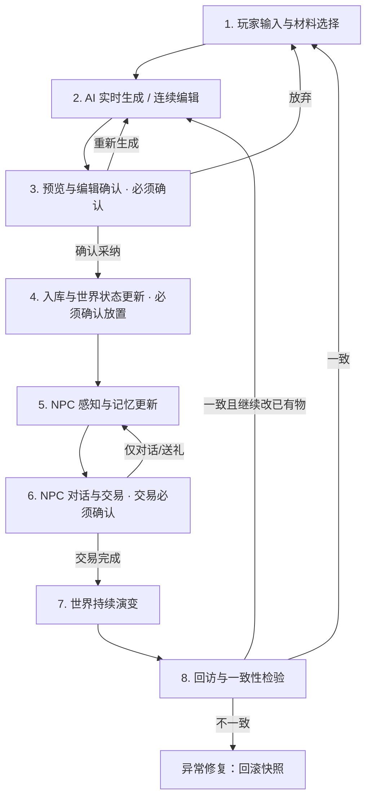

# 交付一：产品定位 + 交互流程 + 成立逻辑

**产品名：**《我的AI小岛》  
**命题对齐：** 玩家用语言与操作实时重塑世界，世界随之演化；回访痕迹对得上才可信。  
**技术前提（题目给定）：** 交互式视觉模型（文本/图像指令实时生成 + 对生成结果持续编辑）+ 通用游戏引擎可做原型 + 有玩家可测。

**本交付范围：** 定位、成立依据、完整「塑造 → 回应」交互（含自动/确认分工）。  
**明确不在本交付展开、但口径已钉死：** 可玩原型见交付二；投资与世界表现评测见交付三。

---

## 一、一句话产品定义

> 面向愿意亲手改世界的模拟经营玩家——通过 **「材料约束的 AI 创造 + 确认后写入的世界状态持久化 + 有记忆的 NPC 回应 + 可追溯的连续编辑」**，解决「AI 生成世界缺乏一致性与持久记忆：玩家回访痕迹对不上就停玩」的核心痛点。

能生成 ≠ 能玩。玩法成立的性命门是两件事同时成立：

1. **回访一致：** 离开再回来，创造物还在、位置对、NPC 还记得。  
2. **连续编辑：** 可在已写入结果上继续改，而不是每次重骰一个新世界。

---

## 二、核心问题界定

> 玩家在 **日常塑造与回访检验** 中，因 **AI 实时生成世界缺少持久状态与前后一致**，导致 **创造物消失/变样、摆放错乱、NPC 不记得互动，沉浸崩塌并停玩**。现有产品要么只有预设内容（可信但不可塑），要么只有一次性生成（自由但无记忆），未能同时满足「自由塑造」与「世界可信」。

**不是**「玩家能不能用 AI 造东西」。  
**而是**「造出来的东西能不能被世界记住，回访时痕迹对不对得上，能不能接着改」。

---

## 三、成立逻辑

### 3.1 题目线索 → 产品判断

| # | 题目线索 | 产品判断 |
|---|---|---|
| 1 | 传统内容由美术预设，玩家改不了世界 | 入口：用语言/操作 + 材料约束，实时塑造岛内场景与物品 |
| 2 | 交互视觉模型支持指令生成与持续编辑 | 主能力必须是「生成 + 对已有结果继续编辑」，写入后仍可改 |
| 3 | 玩家用回访判断可信度；痕迹对不上就停玩 | 胜负手：世界状态持久化 + 快照校验 + 确认门禁；这是成立条件，不是锦上添花 |

### 3.2 因果链

```
世界不可塑 → 玩家要能亲手改世界
生成模型解决「能不能造」→ 但无状态生成「这次好看、下次对不上」
玩家回访检验痕迹 → 对不上 → 出戏 → 停玩
结论：自由塑造是入口；持久化 + 确认写入 + 连续编辑 + NPC 记忆才是玩法能否成立的胜负手
```

### 3.3 三维度判断（可证伪）

| 维度 | 判断逻辑 | 可验证标准（估算，需玩家局校准） |
|---|---|---|
| **痛点强度** | 回访是塑世玩法的自然检验 | ≥60% 目标玩家表示「改过的场景回访对不上会停玩」；人均日回访 ≥1 |
| **方案缺口** | 预设世界一致但不可塑；纯生成可塑但不记得 | 「回访不一致」为主要差评之一，实验局 7 日留存偏低 |
| **解法可行** | 模型可生成+持续编辑；状态可持久化；确认门禁可控写入 | 物品持久化率、位置准确率、多轮编辑累积一致性达阶段门槛（详见交付三）；可玩延迟 ≤5s（上限 10s） |

### 3.4 反证

- 目标玩家并不想亲手改世界，更想消费精品预设 → 入口不成立  
- 现有生成玩法已做到高回访一致与可接受留存 → 缺口不成立  
- 无法把结果稳定写入、或连续编辑必然破坏旧痕迹 → 技术路径不成立  

### 3.5 商业化口径（定位提及，不进核心流程）

远期可以说「AI 创造物被第三方（NPC 市场 / 将来的访客）看见并给出价格」，把创造价值固定下来。  
**本次不进入核心流程与 Demo：** 不做玩家间交易、不做 UGC 抽成。经济只保留 **玩家 → NPC 单向交易** 作为长线设计；Demo 里交易不跑完整循环，仅作 NPC 对话背景叙事。

---

## 四、目标用户、场景与边界

### 4.1 用户

| 分层 | 特征 | 优先级 |
|---|---|---|
| 塑世型模拟经营玩家 | 动森/星露谷向；会改造家园并回访检验 | P0 |
| 创造/装扮型玩家 | 要「我的岛和别人不一样」 | P0 |
| AI 尝鲜者 | 早期验证与口碑 | P1 |

### 4.2 场景

| 场景 | 玩家在做什么 | 对应题眼 |
|---|---|---|
| **实时塑世（主）** | 选材料 + 一句话/参考图生成或编辑 → 预览确认 → 放置确认 → 写入 | 语言和操作重塑世界 |
| **世界回应** | NPC 感知新创造、更新记忆、对话态度变化；环境对写入做可见反馈 | 世界随之演化 |
| **回访检验（性命门）** | 再登录：物品还在、位置对、可继续编辑；NPC 记得关键事件 | 痕迹对得上才继续玩 |
| **连续编辑** | 对已写入的灯/码头做局部再编辑，主体保持 | 持续编辑能力，而非一次生成 |

### 4.3 做什么 / 不做什么

**做：** 材料约束的生成与持续编辑；确认后持久化（模型、位置、旋转、属性、编辑记录、快照）；NPC 独立记忆（对话/创造物/关键事件永久、日常记忆衰减）；轻度规则化世界演变（季节、作息、植物生长）且 **不覆盖已确认创造物**；玩家→NPC 单向交易（长线）。

**不做（本期）：** 战斗 RPG；实时多人同岛同写；玩家间交易与 UGC 抽成；无边界大世界；无约束整岛重骰。

**Demo 边界（交付二必须遵守）：**

- 核心主线只演示 **一致性闭环 + 连续编辑**：生成 → 编辑确认 → 放置确认 → 持久化 → 离开 → 回访一致 → 继续编辑。  
- 生成可用 **预设物品模拟**；持久化可用 **前端/本地状态模拟**，不依赖真实模型。  
- NPC 记忆用脚本化反应演示「记得/回应」；经济循环不演示。  
- 真实模型能力核验、分阶段上线门槛、以及「躲猫猫类单局」作为低成本先验证实时生成、再引入持久化与世界记忆的路径 → **全部放入交付三**。

---

## 五、交互设计原则（自动还是确认）

目标：用 **「AI 处理低风险 + 玩家拍板高风险 + 世界状态全程持久化」**，在创造自由与世界可信之间取得平衡。

| 维度 | 问自己 |
|---|---|
| **出错代价** | 出错是只影响这一步，还是会污染世界状态、导致回访不一致？ |
| **可逆性** | 能否一键撤销/再改？成本高不高？ |

- 低代价 + 可逆 → **全自动**  
- 高代价 + 不可逆（或回访会被当面检验）→ **必须玩家确认**  
- 中间地带 → 系统建议，玩家可调  

确认不是审批，是校准：每一次确认、编辑、放弃，都在写玩家偏好，也在写 NPC 记忆。

### 本期三个必须确认的环节

| # | 环节 | 为什么必须拍板 |
|---|---|---|
| 1 | **生成结果预览确认** | 内容对不对直接进入世界；没确认就写入 = 回访看到「这不是我造的」 |
| 2 | **放置位置确认** | 放哪、怎么摆是回访最直观的检验；系统乱放会出戏 |
| 3 | **NPC 交易确认** | 卖了就没了，且写入 NPC 记忆与经济；**Demo 不跑交易闭环，流程上仍保留此门禁** |

---

## 六、端到端流程：玩家塑造 ↔ 世界回应



橙色语义 = 必须确认；蓝色语义 = 自动 + 可调整；红色 = 异常。  
环节 6 的交易在 Demo 中降为叙事；链路仍要能讲清「不可逆经济操作必须拍板」。

---

## 七、各环节说明

### 环节 1：玩家输入与材料选择

| 项目 | 内容 |
|---|---|
| 输入 | 背包材料（贝壳/木材/矿石/花等）+ 自然语言 / 参考图 + 可选「在已有物体上继续编辑」 |
| 系统 | 材料数量校验、意图理解、可行性判断（够不够、能否执行、是否命中已有资产） |
| 玩家 | 选材料、说一句（如「用贝壳和木头做水母吊灯」）、选生成件数或选中已有物再编辑 |
| 输出 | 生成/编辑请求（材料清单 + 描述 + 偏好历史 + 目标地块或目标物体 ID） |
| 责任 | **全自动辅助**；最终输入决策在玩家 |

异常：材料不足提示还差什么；描述不清给示例改述。阻塞生成。

### 环节 2：AI 实时生成 / 对已有结果连续编辑

| 项目 | 内容 |
|---|---|
| 输入 | 生成请求；若为连续编辑则附带已写入资产与锁定部分（如码头主体锁定、只改灯） |
| 系统 | 调用交互视觉模型生成或局部编辑；材料与邻接风格约束；参考历史偏好 |
| 玩家 | 等待；可见步骤（理解 → 轮廓 → 细节 → 材质） |
| 输出 | 初稿（3D/场景块 + 属性 + 将消耗材料 + 将影响的地块/物体） |
| 责任 | **全自动**（低风险、可逆：不满意可重来） |

生成失败不扣材料；超时（>10s）可等可取消。  
**连续编辑约束：** 未声明修改的部分保持与世界状态一致，避免「改灯把码头重骰掉」。

### 环节 3：预览与编辑确认 — 必须确认

| 项目 | 内容 |
|---|---|
| 系统 | 3D 预览、高亮本次生成/编辑区域、提供颜色/大小/旋转/局部重绘、展示材料消耗 |
| 玩家 | 预览；**确认采纳 / 再生成（可扣材料） / 放弃（不扣材料）** |
| 输出 | 玩家确认的最终物品 + 编辑记录 |
| 责任 | **必须确认** |

未确认不得写入正式世界。确认/编辑/放弃记录进入偏好，反哺后续生成。

### 环节 4：入库与世界状态更新 — 必须确认放置

| 项目 | 内容 |
|---|---|
| 系统 | 持久化：模型、属性、创建时间、编辑记录；更新仓库；**变化后打世界快照** |
| 玩家 | 入仓库 **或** 拖拽放置到岛上指定位置（位置、旋转必须玩家定） |
| 输出 | 更新后的世界状态（仓库 + 岛上布置） |
| 责任 | 持久化自动；**放置必须玩家确认** |

持久化是流程基石：

- 每件物品的模型、位置、旋转、属性、创建时间写入唯一世界状态  
- 每次状态变化打快照，可回溯  
- 玩家离开后状态冻结；再登录按状态精确恢复（演变见环节 7，且不覆盖已确认创造物）  
- **这是「痕迹对不上」的技术解，不是氛围文案**

写入失败：重试 3 次，仍失败则物品暂存临时仓，阻塞进入后续正式世界环节。

### 环节 5：NPC 感知与记忆更新 — 全自动

| 项目 | 内容 |
|---|---|
| 输入 | 新世界状态；玩家创造了什么、放在哪、说过什么 |
| 系统 | NPC 感知新物；写入该 NPC 记忆库；按记忆与关系生成反应 |
| 玩家 | 靠近触发；看到记得自己的反应（「你做了水母吊灯，好特别」） |
| 输出 | NPC 记忆 + 关系 + 情绪 |
| 责任 | **全自动**（玩家要的是「记得我」，不是「帮 NPC 记笔记」） |

记忆设计：

- 每 NPC 独立记忆：话语、行为、礼物、交易、玩家创造物  
- 日常记忆可衰减；**关键事件永久**（第一次创造被看见、特别礼物等）  
- 对话态度、后续定价（长线）受记忆影响  
- 记忆更新失败不打断当前对话，后台重试  

**演化载体：** NPC 不是预设台词机，而是随玩家行动更新的世界角色。Demo 用脚本化记忆条目演示即可。

### 环节 6：NPC 对话与交易 — 交易必须确认

| 项目 | 内容 |
|---|---|
| 系统 | 基于记忆生成对话；长线可给收购报价 |
| 玩家 | 对话/送礼；若交易：**接受 / 还价 / 取消** 必须拍板 |
| 输出 | 对话记录、关系变化；若成交则金币与物品转移并写入记忆 |
| 责任 | 对话可自动生成选项；**成交必须确认** |

不可逆：珍藏被自动卖掉会直接弃玩。历史成交进入记忆，影响后续态度/定价。

**本期降权：** Demo 只演示「NPC 提到你刚放的灯」这类记忆回应，不跑买卖闭环。定价机制（需求 × 好感 × 独特性）留在长线说明，不进入交付二。

### 环节 7：世界持续演变 — 自动，大更新需知情确认

| 项目 | 内容 |
|---|---|
| 系统 | 季节、节日、NPC 作息、植物生长、天气；基于玩家行为与 NPC 状态，**有记忆的演变** |
| 玩家 | 被动体验；关系好可收到节日邀请等 |
| 责任 | 日常演变 **全自动**；季节切换等外观大更新 **提前通知，确认是否保留当前布置后再更** |

玩家不在时世界可自然变化，但 **已确认创造物与 NPC 关键记忆不变**。回来看到的是「不在时发生了这些事」，不是「我造的没了」。

### 环节 8：回访与一致性检验 — 系统保障，玩家会主动考

| 项目 | 内容 |
|---|---|
| 系统 | 加载持久化状态；对比最近快照做校验；展示离开期间变化摘要（只含允许的演变） |
| 玩家 | 看自己的东西还在不在、位置对不对、NPC 记不记得；可对已有物发起连续编辑（回到环节 2） |
| 责任 | **全自动保障**；玩家不确认「世界是否正确」，但会用眼睛考你 |

校验失败：**宁可回滚到最近一致快照并提示已恢复，也不把不一致世界展示给玩家。**

这是全流程最终考场。前 7 步的确认、持久化、NPC 记忆，都为这一关服务。

---

## 八、异常处理

| 环节 | 异常 | 处理 | 是否阻塞 |
|---|---|---|---|
| 材料 | 不足 / 描述不清 | 提示补材料或改述 | 是 |
| 生成 | 失败 | 不扣材料，可重试 | 否 |
| 生成 | 超时 >10s | 可等待或取消，取消不扣材料 | 否 |
| 预览 | 重生成 >3 次 | 建议改描述或换材料，不强制 | 否 |
| 写入 | DB/状态失败 | 重试 3 次，失败进临时仓 | 是 |
| NPC 记忆 | 更新失败 | 对话不中断，异步重试 | 否 |
| 交易 | 还价被拒 | 最终价，接受或取消；好感微降 | 否 |
| 演变 | 季节大更新 | 提前通知，确认保留布置后才更 | 是（需确认） |
| 回访 | 校验失败 | 回滚一致快照，不展示错乱世界 | 否（系统处理） |

原则：**AI 不确定时示弱，不硬给结果。**

---

## 九、反馈闭环（留存逻辑，非 Demo 必做功能）

| 行为 | 记录 | 反哺 |
|---|---|---|
| 生成确认 | 采纳 / 编辑 / 放弃 / 重生成次数 | 偏好画像，后续更好生成 |
| 放置 | 位置、朝向、邻接物 | 空间与审美习惯 |
| NPC 对话 | 选项、礼物 | NPC 记忆、关系 |
| 交易（长线） | 成交价、还价 | NPC 定价与需求 |
| 回访 | 注视点、是否报不一致、停留 | 一致性薄弱环节 |

确认成本应被理解为对「专属模型 / 专属 NPC / 专属岛」的投资，而不是纯操作税。

---

## 十、一条应对齐 Demo 的典型脚本（交付二）

不演示完整经济。只走性命门：

1. 选木材+贝壳，输入「水母形状吊灯」。  
2. 系统给出预览（Demo 可用预设模型冒充生成）。  
3. **玩家确认外观**（可改颜色/大小）。  
4. **玩家拖到岸边小屋梁上确认放置**。  
5. 状态写入（Demo 用前端状态即可）；NPC 走近说出记住这盏灯的台词。  
6. **模拟离开再进入**：灯仍在原位置。  
7. 对同一盏灯连续编辑「改成玻璃风灯」→ **再次预览确认** → 灯变、位置与挂钩不变。  
8. 若人为破坏状态，回访走回滚提示，不展示错乱岛。

---

## 十一、阅卷对照

| 题目要求 | 本文位置 |
|---|---|
| 玩法定位与解决的问题 | 一、二、四 |
| 定位成立依据 | 三 |
| 玩家如何塑造、世界如何回应 | 六、七 |
| 哪些步骤必须玩家确认/介入 | 五、环节 3/4/6、环节 7 大更新 |
| 世界状态持久化如何落地 | 环节 4、8、异常回滚 |
| NPC 记忆如何落地 | 环节 5、6 |
| 为 Demo / 评测留接口 | 4.3 Demo 边界、十、3.3；指标与「躲猫猫」验证路径见交付三 |

**灵魂三件套：** 三个确认节点 + 世界状态持久化（含快照回滚）+ NPC 记忆。  
**性命门：** 回访一致 + 连续编辑。二者缺一，定位不成立。
